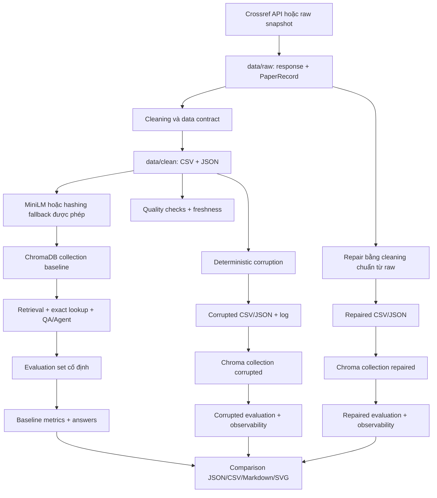

# Day 10 — Data Pipeline & Data Observability

Pipeline RAG học thuật dùng Crossref, ChromaDB, retrieval/evaluation và data observability để chứng minh tác động của chất lượng dữ liệu qua ba trạng thái baseline, corrupted và repaired.

Repository: <https://github.com/Lsdfs/K3_Day10_Data-Pipeline-Data-Observability>

## Kiến trúc



| Stage | Input | Output/artifact | Dependency |
| --- | --- | --- | --- |
| Ingestion | Crossref query/filter | `data/raw/` | `requests`, Settings |
| Cleaning | `PaperRecord` | clean CSV/JSON | pandas |
| Embedding/index | clean dataframe | manifest + Chroma collection | MiniLM hoặc explicit fallback |
| Retrieval/QA | query + collection | contexts, IDs, extractive answer | Chroma |
| Evaluation | cùng `test_set.json` | metrics + answers | retrieval/QA |
| Observability | dataframe | quality/freshness JSON | data contract |
| Corruption | baseline clean | corrupted data + log | seed cấu hình |
| Repair | raw snapshot | repaired data/index/metrics | standard cleaning |
| Reporting | JSON metrics/quality | Markdown, CSV, SVG | generated artifacts |

## Cấu trúc

```text
src/core/             Settings, paths, utilities
src/ingestion/        Crossref, cleaning, corruption
src/retrieval/        embeddings, Chroma, QA, agent, LLM providers
src/evaluation/       deterministic test set và metrics
src/observability/    quality, freshness, reports, visualization
src/pipelines/        orchestration, CLI và audit
script/               Python entrypoints tương thích
tests/                unit, integration và offline smoke tests
data/                 artifacts của lần chạy thực tế
report/               group report và role reports
```

## Môi trường và cài đặt

- Python `>=3.11,<3.14`
- Internet cho live Crossref và tải MiniLM lần đầu
- API key chỉ cần khi bật LLM judge/agent provider thật

Với `uv`:

```powershell
uv sync --extra dev
```

Với `pip`:

```powershell
python -m venv .venv
.\.venv\Scripts\Activate.ps1
python -m pip install --upgrade pip
python -m pip install -e ".[dev]"
```

Tạo `.env` từ `.env.example`; không commit file này.

## Embedding backend và offline fallback

Mặc định:

```dotenv
EMBEDDING_BACKEND=minilm
ALLOW_EMBEDDING_FALLBACK=false
```

MiniLM `sentence-transformers/all-MiniLM-L6-v2` được dùng khi model tải/cache được. Chạy offline có chủ đích:

```powershell
$env:ALLOW_EMBEDDING_FALLBACK='true'
$env:EMBEDDING_BACKEND='hashing'
```

Fallback không tự bật. Manifest ghi `embedding_backend`, dimension và lý do; artifact hiện tại dùng `local_hashing_fallback`, dimension 384. Không tuyên bố đó là MiniLM.

## CLI

```powershell
day10-pipeline --help
day10-pipeline baseline
day10-pipeline corruption
day10-pipeline all
day10-pipeline audit
```

Hoặc dùng entrypoint cũ:

```powershell
python script/run_phase1.py
python script/run_corruption_flow.py
```

`baseline` fetch khi chưa có snapshot hoặc `REFRESH_SOURCE=true`; `corruption` yêu cầu baseline artifacts; `all` chạy hai flow; `audit` parse/validate artifacts, docs, metrics, test-set hash và file Git tracked.

## Tests và static checks

```powershell
python -m pytest -q -p no:cacheprovider --basetemp .pytest_tmp_runtime
python -m compileall src script
git diff --check
```

Unit tests không gọi Crossref/LLM thật. Offline smoke test chạy cả baseline và corruption/repair trên fixture với Chroma tạm.

## Artifact matrix

| Nhóm | Artifact chính |
| --- | --- |
| Raw | `crossref_response.json`, `crossref_records.json`, `ingestion_summary.json` |
| Clean | baseline/corrupted/repaired CSV + JSON |
| Embedding | ba manifest trong `data/embeddings/`; collections trong `data/chroma/` |
| Evaluation | `data/eval/test_set.json` |
| Results | metrics, answers, corruption log, comparison JSON |
| Quality | baseline/corrupted/repaired quality và freshness |
| Reports | phase 1, corruption, comparison CSV và SVG, audit JSON |

## Metrics

- `retrieval_hit_rate`: tỷ lệ câu có ground-truth DOI trong top-k.
- `mean_token_f1`: overlap token có xét số lần xuất hiện giữa reference và answer.
- `judge_accuracy`: tỷ lệ verdict correct.
- `mean_judge_score`: điểm judge trung bình 1–5.
- `judge_mode`: `heuristic`, `llm` hoặc `heuristic_fallback`.

Lần chạy hiện tại dùng heuristic judge vì `ENABLE_LLM_JUDGE=false`; Ragas được skip khi `RUN_RAGAS=false`. Không có kết quả LLM giả.

## Provider support

`gemini`, `openai`, `anthropic`, `openrouter`, `ollama` và OpenAI-compatible `custom`. Credential được validate theo provider và ẩn khỏi dataclass repr. `.env` chỉ được đọc từ project root.

## Kết quả hiện tại

| Signal | Baseline | Corrupted | Repaired |
| --- | ---: | ---: | ---: |
| Retrieval hit rate | 1.0000 | 0.5000 | 1.0000 |
| Mean token F1 | 1.0000 | 0.6509 | 1.0000 |
| Judge accuracy | 1.0000 | 0.6250 | 1.0000 |
| Mean judge score | 5.0000 | 3.5000 | 5.0000 |
| Quality | PASS | FAIL | PASS |
| Freshness | fresh | stale_or_invalid | fresh |

Nguồn: `data/results/*.json` và `data/quality/*.json`. Report sinh tự động từ cùng payload.

## Troubleshooting

| Lỗi | Cách xử lý |
| --- | --- |
| MiniLM không tải được | Cấp Internet/model cache; hoặc bật explicit hashing fallback như trên |
| Thiếu API key | Giữ `ENABLE_LLM_JUDGE=false` hoặc cấu hình đúng provider |
| Crossref 429/5xx | Pipeline retry hữu hạn với exponential backoff và `Retry-After` |
| Corruption báo thiếu baseline | Chạy `day10-pipeline baseline` trước |
| Windows pytest Temp permission | Dùng `--basetemp .pytest_tmp_runtime -p no:cacheprovider` |
| Audit FAIL | Đọc `data/reports/audit_report.json` và sửa từng error code |

## Git và secret

Không track `.env`, `.venv`, cache model, pytest temp/cache, `__pycache__`, `*.pyc`, token hoặc API key. Không force-push/reset lịch sử. Chroma test database chỉ nằm trong ignored pytest temp; `data/chroma/` là artifact pipeline thực tế.

## Giới hạn

- Artifact hiện tại chứng minh hashing fallback, chưa phải bằng chứng runtime MiniLM.
- LLM judge và Ragas chưa chạy vì được tắt; metrics chính vẫn là offline deterministic.
- Evaluation set gồm 8 câu trên corpus 24 records, phù hợp lab nhưng chưa đại diện production.

Xem thêm: [Guide](Guide.md), [Rubric](Rubric.md), [Rubric audit](RUBRIC_AUDIT.md), [group report](report/group_report.md), [submission checklist](SUBMISSION_CHECKLIST.md).
