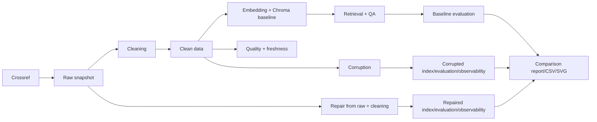

# BÁO CÁO NHÓM — DAY 10 DATA PIPELINE & DATA OBSERVABILITY

## 1. Thông tin dự án

| Thuộc tính | Giá trị |
| --- | --- |
| Repository | <https://github.com/Lsdfs/K3_Day10_Data-Pipeline-Data-Observability> |
| Nhánh kiểm chứng | `NGUYENQUANGHUY` |
| Khóa/Lớp | K3 |
| Ngày chạy artifact | 2026-08-06 |
| Mục tiêu | Chứng minh data quality ảnh hưởng RAG và repair phục hồi hệ thống |

| Thành viên | MSSV | Vai trò |
| --- | --- | --- |
| Chu Thị Yến Khanh | 2A202601739 | Trưởng nhóm |
| Nguyễn Quang Huy | 2A202601873 | Thành viên — ROLE 1 architecture/integration |
| Nguyễn Quốc Việt | 2A202601737 | Thành viên — ingestion |
| Diêm Công Thành | 2A202601689 | Thành viên — cleaning/observability |

Phân công Input/Output/Artifact/Test/DoD: `PHAN_CONG_CONG_VIEC.md`.

## 2. Architecture và workflow



Baseline thực hiện source/snapshot → cleaning → clean CSV/JSON → collection `papers-baseline` → test set → metrics/answers → quality/freshness → report. Corruption flow dùng clean baseline và test set cũ, tạo collection `papers-corrupted`; repair đọc lại raw snapshot, chạy cleaning chuẩn và tạo `papers-repaired`.

## 3. Data source và cấu hình

| Cấu hình | Giá trị thực tế |
| --- | --- |
| Source | Crossref REST API `/works` |
| Query | `agentic retrieval augmented generation large language model` |
| Filter | 2026-02-07 đến 2026-08-06, có abstract |
| Requested/valid rows | 24 / 24 |
| Timeout/retry | 20 giây / tối đa 4; lần chạy dùng 1 attempt |
| Freshness threshold | 180 ngày |
| Retrieval top-k | 4 |
| Corruption seed | 2026 |
| Embedding cấu hình | explicit hashing fallback, 384 chiều |
| LLM judge | tắt; heuristic deterministic |
| Ragas | skip theo cấu hình |

Embedding manifest ghi `embedding_model=null` và `embedding_backend=local_hashing_fallback`; báo cáo không gọi fallback là MiniLM.

## 4. Data contract và cleaning

Raw `PaperRecord` gồm DOI/stable ID, title, summary, authors, categories, dates, URLs và comment. Parser strip HTML/JATS, deduplicate và tạo stable SHA-256 fallback ID nếu DOI thiếu. Cleaning yêu cầu ID/title/summary/published, normalize list/text/date, deduplicate DOI và tạo:

- `authors_joined`, `categories_joined`
- `summary_chars`, `age_days`
- `text_for_embedding`

Output baseline có 24 rows, 16 columns và 0 duplicate.

## 5. Evaluation

Test set có 8 câu deterministic thuộc bốn loại summary/authors/date/categories. Cả ba metrics files có cùng SHA-256:

`688abc2f256509308302a8185267d220f2b899d76ff9224acdf03af10c954503`

| Metric | Baseline | Corrupted | Repaired | Corruption Δ | Repair Δ |
| --- | ---: | ---: | ---: | ---: | ---: |
| Retrieval hit rate | 1.0000 | 0.5000 | 1.0000 | -0.5000 | +0.5000 |
| Mean token F1 | 1.0000 | 0.6509 | 1.0000 | -0.3491 | +0.3491 |
| Judge accuracy | 1.0000 | 0.6250 | 1.0000 | -0.3750 | +0.3750 |
| Mean judge score | 5.0000 | 3.5000 | 5.0000 | -1.5000 | +1.5000 |

Judge mode là heuristic ở cả ba trạng thái. Không có tuyên bố gọi LLM thật.

## 6. Quality và freshness

Quality suite có 15 checks: dataset/required columns, ID completeness/uniqueness/duplicate rate, title/summary/embedding text, date/age, stale rate, author/category và URL.

| Signal | Baseline | Corrupted | Repaired |
| --- | ---: | ---: | ---: |
| Rows | 24 | 21 | 24 |
| Quality checks | 15 PASS / 0 FAIL | 10 PASS / 5 FAIL | 15 PASS / 0 FAIL |
| Duplicate rows | 0 | 2 | 0 |
| Empty summary rows | 0 | 2 | 0 |
| Stale rows/rate | 0 / 0 | 1 / 0.047619 | 0 / 0 |
| Freshness | fresh | stale_or_invalid | fresh |
| Median/max age | 66 / 175 | 67 / 3811 | 66 / 175 |

## 7. Corruption và repair

Corruption log ghi seed, input/output rows, affected DOI và sáu scenario: drop 4 latest records; blank summary; inject 12 noise tokens; truncate title; shift date 3650 ngày; duplicate row. Baseline CSV hash được kiểm tra trước/sau để bảo đảm không mutate.

Repair không copy baseline metrics và không chỉnh corrupted metrics. Nó đọc `crossref_records.json`, chạy lại `build_clean_dataframe`, build collection riêng, chạy lại evaluation/quality/freshness.

Chuỗi nhân quả có bằng chứng:

1. Drop/mutation/duplicate/stale → quality/freshness fail và hit rate giảm 0.5000.
2. Repair từ raw → quality/freshness trở lại PASS/fresh và bốn metrics trở về baseline.

## 8. Artifact

| Nhóm | Đường dẫn |
| --- | --- |
| Raw | `data/raw/` |
| Clean states | `data/clean/` |
| Chroma/manifests | `data/chroma/`, `data/embeddings/` |
| Evaluation | `data/eval/test_set.json` |
| Metrics/answers/log | `data/results/` |
| Quality/freshness | `data/quality/` |
| Reports/comparison | `data/reports/` |

## 9. Lệnh tái hiện và kết quả test

```powershell
uv sync --extra dev
python -m pytest -q -p no:cacheprovider --basetemp .pytest_tmp_runtime
day10-pipeline --help
$env:ALLOW_EMBEDDING_FALLBACK='true'
$env:EMBEDDING_BACKEND='hashing'
day10-pipeline all
day10-pipeline audit
```

Regression suite: 15 tests PASS. Baseline và corruption/repair exit code 0 sau khi sửa lỗi Windows console encoding.

## 10. ROLE 1 integration issue

- **Triệu chứng:** corruption stages hoàn tất nhưng CLI exit 1 khi in summary.
- **Root cause:** Windows active code page không encode ký tự Unicode arrow.
- **Sửa:** terminal summary dùng ASCII `->`; Markdown/SVG vẫn UTF-8.
- **Xác minh:** chạy lại `day10-pipeline corruption`, exit code 0 và artifact không sửa tay.

## 11. Limitations

- Artifact hiện tại dùng hashing fallback; runtime MiniLM cần Internet/model cache.
- LLM judge/Ragas chưa chạy; heuristic mode được ghi rõ.
- Corpus 24 và evaluation 8 phù hợp lab, chưa phải production benchmark.
- Commit/PR/chữ ký/slide của từng người cần đúng thành viên tự thực hiện.

## 12. Submission

Checklist chi tiết nằm tại `SUBMISSION_CHECKLIST.md`; Rubric evidence nằm tại `RUBRIC_AUDIT.md`. ROLE 1 không tự ký hoặc giả mạo đóng góp của thành viên khác.
